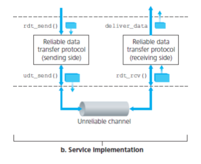
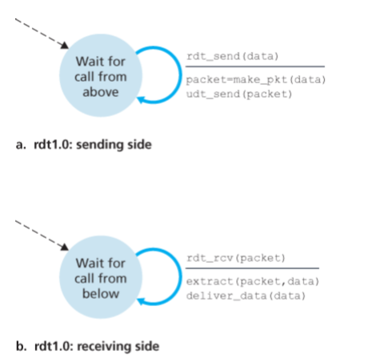
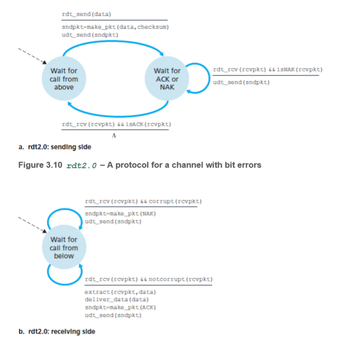
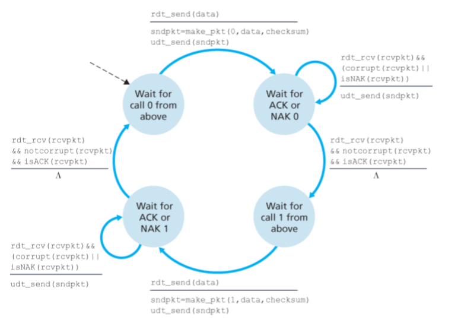
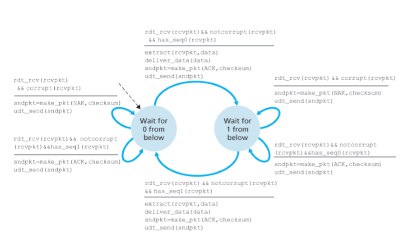
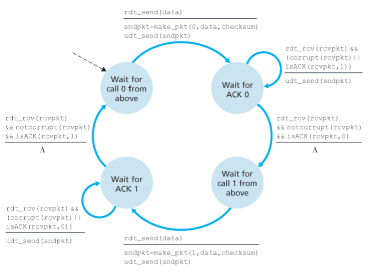
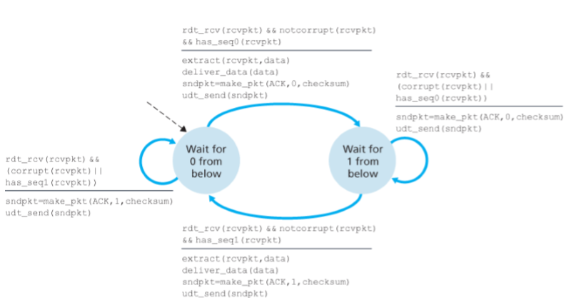
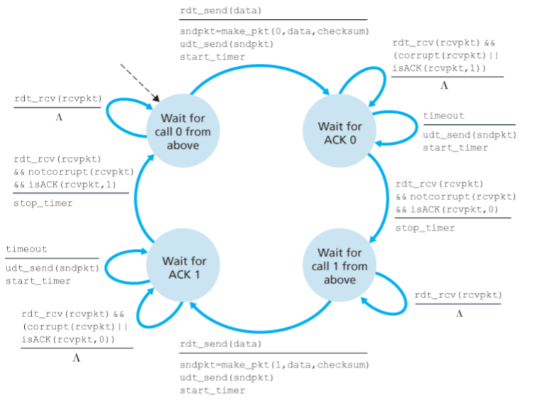
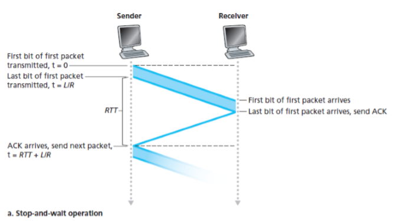
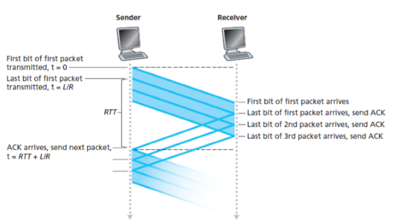

# 네트워크

## Roadmap

### What is Internet?

#### Nuts-and-Bolts view
**Interent is network of networks**
* host: end systems running network apps
        (pc, server, wireless laptop, smartphone)
* communication links: fiber, copper, radio, satelite
                       (bandwidth is important factor of transmission rate)
* packet switches: forward packets from incoming communication link to outgoing communication link
                   (routers, link-layer switches)
* ISP: network of communication link and packet switches
* protocol: control sending, receiving of packets
            (TCP/IP, HTTP, SKYPE)
* Internet Standards: for protocol standards
                      (RFC, IETF)
#### Service view
* Infrastructure that provides services to applications
* End systems provide socket interface that specifies on one end system asks the Internet infrastructure to deliver data to a specific destination program
running on another end system

### What is Protocol
* format and order of messages exchanged between two or more communicating entites, as well as the actions taken on the transmission and/or receipt of a message or other event

### Network Edge
* host = end systems

### Access Network
* the network that physically connects an end system to the first router(edge router)

connect by 
* residiential access nets
* institutional access networks
* mobile access network

#### Broadband residential access
* DSL(digital subscriber line)
    * uses telephone line as communication link (twiswted copper wire)
    * telephone line carries both data and traditional telephone signals simultaneously, which
are encoded at different frequencies
    * 2.5Mbps upstream transmission rate, 24Mbps downstream transmission rate
      -> asymmetric transmission rate
    * DSLAM turns analog signals sent into digital signals

* Cable network
    * makes use of cable television company’s existing cable television infrastructure
      (coaxical cables)
    * frequency division multiplexing
    * coaxical cable is used to connect individual houses, and fiber is used to connect cable head end to neighbor-level junctions  
      -> HFC(hybride fiber coax): coaxical cable and fiber is both used
      -> **unlink DSL, homes share access network**
    * CTMS turns analog signals sent into digital signals 
    * every packet sent by the head end travels downstream on every link to every home and every
* packet sent by a home travels on the upstream channel to the head end.

* Ethernet
    * uses twisted-pair copper wire to connect to an Ethernet switch
    * users have 100Mbps or 1Gbps to ethernet switch, 1Gbps or 10Gbps to servers

* Wireless LAN
* shared wireless access network connects end system to router through base station(access point)
    * WLAN -> MIMO(multi input multi output)
        * 802.11n (< 135Mbps, 2,4and 5GHZ band)
		* 802.11ac
		* 802.11ah
    * WAN
        * provided by telco operator
          (3G, 4G, LTE)
#### Physical Media
* that connects transmitter and receiver
##### Guided media
* signals propagate in solid media
    * twisted copper cable
        * two insulated copper wires
    * coaxical cable
        * two concentric copper conductors
        * bidirectional
    * fiber optic cable
        * two concentric copper conductors bidirectional
        * high speed operation
        * low error rate
##### Unguided media
* signals propagate freely
    * radio
        * signal carried in electromagnetic spectrum
        * bidirectional
        * propagation environment effects:
            * reflection
            * obstruction by objects
            * interference
        * types
            * terrestrial microwave
            * LAN(WLAN)
            * wide-area(WAN)
            * satellite
##### How to calculate packet transmission delay
* L: length of packet
* R: link transmission rate(capacity, link bandwidth)
* packet transmission delay = L/R

### Network core
* mesh of interconnected packet switches and links that interconnects Internet end systems

#### Packet Switching
* messages: data that end systems exchange
* packets: smaller chunks of data from message
* packets are forwarded from one router to the next, across links on path from source to destination 
* packets are transmitted over each communication link at a rate equal to the full transmission rate of the link

##### Store and Forward Transmission
* entire packet must arrive at router(packet switch) before it can be transmitted on next link

##### Queueing delay and loss
* output buffer(output queue)
    * stores packets that the router is about to send into that link
    * If an arriving packet needs to be transmitted onto a link but finds the **link** busy with the transmission of another packet, the arriving packet must wait in the **output buffer**

* queuing delay
    * If an arriving packet needs to be transmitted onto a link but finds the link busy with the transmission of another packet, the arriving packet must wait in the output buffer
* packet loss
    * when buffer is full with other packets for transmission, either the arriving packet or one of the already-queued packets will be dropped

##### Routing
* determines source-destination route taken by packets
* routing algorithm
    * refers forwarding table and decide which link to forward to    
    * global metric should be minimized

##### Forwarding
* move packets from router’s input to appropriate router output

### Circuit Switching
* reources needed along a path (buffers, link transmission rate) to provide for communication between the end systems are reserved
* uses dedicated resources(does not share resources)

#### FDM (frequency division multiplexing)
* frequency spectrum of a link is divided up among the connections established across the link
#### TDM (time division multiplexing)
* time is divided into frames of fixed duration, and each frame is divided into a fixed number of time slots

### Packet switching vs Circuit switching
* circuit switching pre allocates transmission link and it cannot be used by other even if user is inactive
* packet switching allocates transmission link use on demand

* packet switching is great for bursty data (by sharing resource)
* excessive congestion control is possible with packet switching

### Network of Networks

## Transport Layer

### Introduction
* Transport Layer provides logical connection between application processes running on different host
* Transport Layer breaks pplication messages into segments when sending
* Transport Layer is implemented on the end systems.
    * This means routers do not examine fields of the transport layer segments encapulated with the datagram. It only acts as network layer field of datagram.

#### Transport Layer vs Network Layer
* Transport Layer: logical connection between application processes running on different host
* Network Layer: logical connection between different host

### Overview of the Transport Layer in the Intenet
* TCP & UDP packets as segments, network layer packets as datagram
    * usually UDP packets are also called datagram
* IP(Internet's network layer protocol) is unreliable service
    * best effort delivery service
    * segment delivery not guaranteed
    * orderly delivery of segments not guaranteed
    * integrity of data not guaranteed
* Transport Layer multiplexing and demultiplexing
    * extending host-to-host delivery to process-to-process delivery
* UDP is unreliable service
    * transport layer multiplexing and demultiplexing
    * provides integrity checking by including error detection fields in their segment's header
* TCP is reliable service
    * provides reliable data transfer
        * flow control
        * congestion control
        * seq num
        * ack
        * timer

### Multiplexing and Demultiplexing
* Tranport Layer -> sockets -> processes
* Demultiplexing: delivering the data in transport layer segment to the correct socket
* Multiplexing: gathering data chunks at the source host from different sockets, encalsulate each data with header, and passing it to network layer
* Unique socket identifiers, special field that indicate which socket data should be delivered is needed
    * source port number field, destination port number field
    * 0-1023: well known port numbers
* UDP
    * assigns a port number to socket
    * one process per socket
    * is fully identified by destination IP address, destination port number
* TCP
    * assigns a port number to socket
    * multiple processes per socket (but not necessarily)
    * is fully identified by destination IP address, destination port number, source IP address, source port number

* UDP vs TCP
    * two arriving TCP segments with same destination but different source will be directed to different sockets, but for UDP segments it will be directed to same socket

### UDP
* immediately passes segment to network layer
* no connection establishment
* no connection state
* smalle packet header overhead

### UDP Segment Structure

| 16bit | 16bit |
| --- | --- |
| source port | dest port |
|  length | Checksum |
| application data |

### UDP Checksum
* sender side performs the **1s complement** of the sum of all the 16-bit words in the segment, with any overflow encountered during the sum being wrapped around
    * if overflow occurs at msb, add it to lsb
    * at receiver side sum of all 16bit words should be 111111~~, or else there are error
* no recover

### Principles of reliable data

### RDT 1.0

### RDT 2.0

* Error detection: detect bit error
* Receiver feedback: ACK, NACK
* Retransmission
* stop-and-wait: when sender awaits for retransmitted packet response, rdt_send cannot be called

### RDT 2.1

* ACK and NACK could be corrupted
    * add sequence number to solve

### RDT 2.2

* NACK replaced with duplicate ACK

### RDT 3.0

### Pipelined RDT Protocols

* scenarios
    * no loss
    * lost packet
    * lost ack
    * premature timeout
    
* stop-ans-wait slows performance

* pipelined rdt

### Go Back N

* GBN sender events
    * invocation from above: send only if window is not full
    * receipt of ack: stop timer if received correct ack 
    * timeout: retransmit packets from base (single timer)

* GBN receiver events
    * if correct packet received send ACK
    * discard packets for other cases

### Selective Repeat

* sender retransmit only those packets that it suspects were received in error 
* SR sender events
    * invocation from above: send only if window is not full or buffer
    * timeout: (multiple timer)
    * receipt of ack
* SR receiver events
    * packet with seq num in [recv_base, recv_base+N-1] but out of order packet: send ACK and buffer 
    * packet with seq num in [recv_base, recv_base+N-1] and correct order packet: send ACK